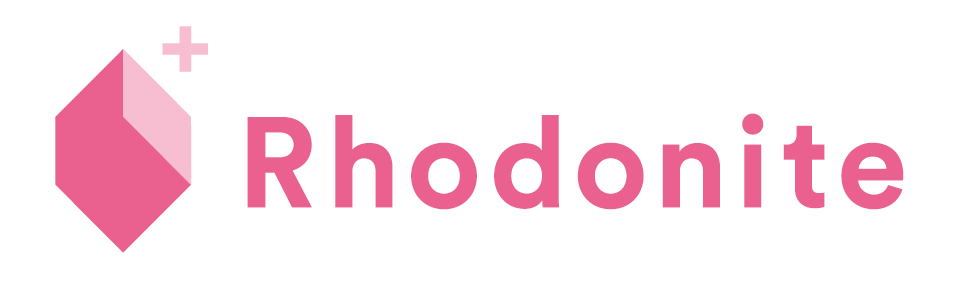
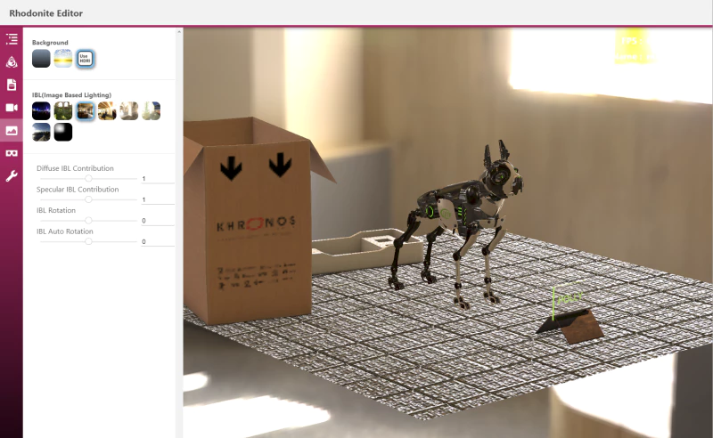

# Rhodonite



Rhodonite is a WebGL library written in TypeScript.


## Feature

* Entity Component System
* Blittable Memory Architecture (Original GPU data storage system with floating point texture)
* Physically based Rendering with Image Based Lighting
* Support loading the following 3D model files: [glTF2](https://github.com/KhronosGroup/glTF), glTF1, [VRM](https://vrm.dev/en/)
* Support [Draco compression](https://google.github.io/draco/), [Basis Universal](https://github.com/BinomialLLC/basis_universal) and [KTX2](http://github.khronos.org/KTX-Specification/), etc

## What's the "Blittable Memory Architecture"


With the Blittable Memory Architecture, Rhodonite stores almost all of its data in a large pre-allocated ArrayBuffer. Data storage for matrix or vector classes in Rhodonite's component classes and materials are assigned from the memory pool, which means most of the data are on that memory pool, transferred to the GPU every frame as a floating-point texture.
This architecture allows all shaders always to access a vast amount of data.

For example, Rhodonite can handle and blend all morph targets (38 targets) of VRM characters simultaneously in the shader.

## Viewer

You can try our library via https://editor.librn.com/ .
This viewer supports glTF/VRM files Drag & Drop to display.
(Drag & Drop all files if glTF data is consists of multiple files.)



## Supported Browsers

Google Chrome, Firefox, Safari, Microsoft Edge (chromium-based), and other modern browsers are supported.
IE11 is not supported.

## Install

You can install the esm version of Rhodonite easily.

```
$ yarn add rhodonite
```

You can install yarn as following,

```
$ npm install -g yarn
```

You can use npm of course, but we recommend yarn because we use it usually.

```
$ npm install rhodonite
```

## Coding with Rhodonite

### In JavaScript

```html
<body>
  <canvas id="world"></canvas>
  <script src="../../../dist/rhodonite.min.js"></script>
  <script>
  async function load() {
    // All Rhodonite classes you need are in window.Rn object.
    await Rn.ModuleManager.getInstance().loadModule('webgl');
    await Rn.ModuleManager.getInstance().loadModule('pbr');
    const system = Rn.System.getInstance();
    const gl = system.setProcessApproachAndCanvas(Rn.ProcessApproach.UniformWebGL1, document.getElementById('world'));
    const entityRepository = Rn.EntityRepository.getInstance();
    ...
    (After that, please refer to the sample codes.)
    ...
  }
  </script>
</body>
```


### In TypeScript

There are two package versions of Rhodonite: esm (ESModule wrapped in CommonJS) and umd.

#### Using esm package

You need a bundler like Webpack to import the Rhodonite esm package directly.

```typescript
import Rn from 'rhodonite'; // All Rhodonite Objects in this
import { CameraComponent, RenderPass } from 'rhodonite'; // for type annotations

async function load() {
  await Rn.ModuleManager.getInstance().loadModule('webgl');
  await Rn.ModuleManager.getInstance().loadModule('pbr');
  const importer = Rn.Gltf1Importer.getInstance();
  const system = Rn.System.getInstance();
  const gl = system.setProcessApproachAndCanvas(Rn.ProcessApproach.UniformWebGL1, document.getElementById('world') as HTMLCanvasElement);

  const entityRepository = Rn.EntityRepository.getInstance();

  // Camera
  const cameraEntity = entityRepository.createEntity([Rn.TransformComponent, Rn.SceneGraphComponent, Rn.CameraComponent, Rn.CameraControllerComponent])
  const cameraComponent = cameraEntity.getComponent(Rn.CameraComponent) as CameraComponent;

  ...
  (After that, please refer to the sample codes.)
  ...
}
```

#### Using umd version for actual object and esm version for type only

You can also use `dist/umd/rhodonite.js` or `dist/umd/rhodonite.min.js` for the actual Rhodonite object by script tag in HTML file.
Then, import types from the `rhodonite` esm package.

```typescript
import _Rn from 'rhodonite'; // Use this for adding type annotations to window.Rn in this sample
import { CameraComponent, RenderPass } from 'rhodonite'; // for type annotations

declare const window: any;
declare const Rn: typeof _Rn; // Use the window.Rn as Rn


async function load() {
  await Rn.ModuleManager.getInstance().loadModule('webgl');
  await Rn.ModuleManager.getInstance().loadModule('pbr');
  const importer = Rn.Gltf1Importer.getInstance();
  const system = Rn.System.getInstance();
  const gl = system.setProcessApproachAndCanvas(Rn.ProcessApproach.UniformWebGL1, document.getElementById('world') as HTMLCanvasElement);

  const entityRepository = Rn.EntityRepository.getInstance();

  // Camera
  const cameraEntity = entityRepository.createEntity([Rn.TransformComponent, Rn.SceneGraphComponent, Rn.CameraComponent, Rn.CameraControllerComponent])
  const cameraComponent = cameraEntity.getComponent(Rn.CameraComponent) as CameraComponent;

  ...
  (After that, please refer to the sample codes.)
  ...

```

In this approach, you don't need any bundler. just compile it by:

```
$ npx tsc ./main.ts --lib es2015,dom --target es2015 --module umd --moduleResolution node
```

For detail, See the typescript-based samples like ./samples/simple/VideoTexture/main.ts .

## Building Rhodonite

### Prerequisites

* Node.js 14.15.5 or later

### Setup Project

```bash
$ yarn install
```

You can use yarn instead.

### Build command for Rhodonite library

```bash
$ yarn build
```

### Build command for samples

```bash
$ yarn build-samples
```

## Try Samples

After building Rhodonite, try:

```bash
$ yarn watch-samples
```

Then, access http://localhost:8082/ with your web browser.
When you are finished, press ctrl + c.

## Build command for API documents

```bash
$ yarn doc
```

## Testing Rhodonite

```bash
$ yarn test
```

You can execute a part of tests like this.

### For unit test

```bash
$ yarn test-unit -- ./src/foundation/core
```

```bash
$ yarn test-unit -- ./src/foundation/core/Entity.test.ts
```

### For E2E (visual) test

```bash
$ yarn test-e2e -- ./samples/test_e2e/FastestInstancedDrawingWebGL1
```

### For M1 Mac in E2E test

If you have trouble with the E2E test in your M1 Mac, Try to install Chromium.

```bash
$ brew install chromium
```
Then try these environment variables.

```bashrc
export PUPPETEER_SKIP_CHROMIUM_DOWNLOAD=true
export PUPPETEER_EXECUTABLE_PATH=`which chromium`
```

See https://stackoverflow.com/questions/65928783/puppeteer5-5-0-install-node-install-js-on-m1 for more detail.

And you can try to uncomment the "executablePath" line.

```javascript
// config/test/jest-puppeteer.config.js
module.exports = {

  ...

  launch: {
    headless: true,
    devtools: false,
    // executablePath: "/Applications/Chromium.app/Contents/MacOS/Chromium", // Try to uncomment this line if you got error in M1 Mac

    args: ["--start-maximized", "--no-sandbox", "--disable-gpu"],
  },
};
```

## Debugging inside VSCode

1. Install the "Debugger for Chrome" VSCode Extension.
2. Start the local server with `$ yarn start`.
3. Push the run icon by choosing "Launch Chrome to debug Rhodonite samples" in the RUN tab of VSCode's left pane to start debugging.

## Development using VSCode devcontainer

This project supports the VSCode devcontainer for any docker-installed OS.

Input the following command in the VSCode command palette.

```
> Remote-Containers: Reopen in Container
```

After a new dev container window opens, You can work in the Debian Linux container environment. All dependencies (node, npm, yarn, typescript, and all packages for Rhodonite) are already set up.

## License

MIT License

## Acknowledgements

### Libraries & Tools

Our library uses the following libraries and tools and more. Thank you.

- [immersive-web/webxr-input-profiles](https://github.com/immersive-web/webxr-input-profiles) (forked version)
- [glTF samples](KhronosGroup/glTF-Sample-Models)

Check the complete list on package.json.

### Contributors


