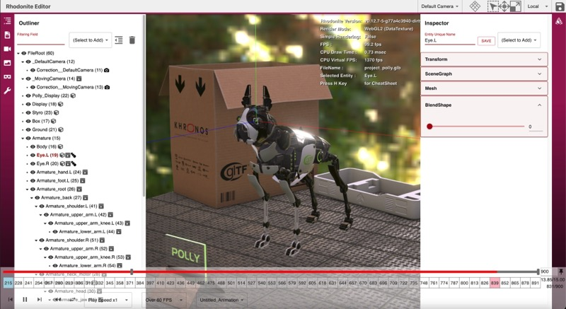
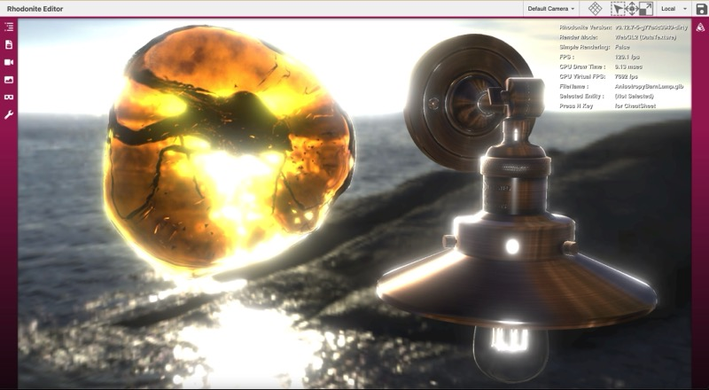
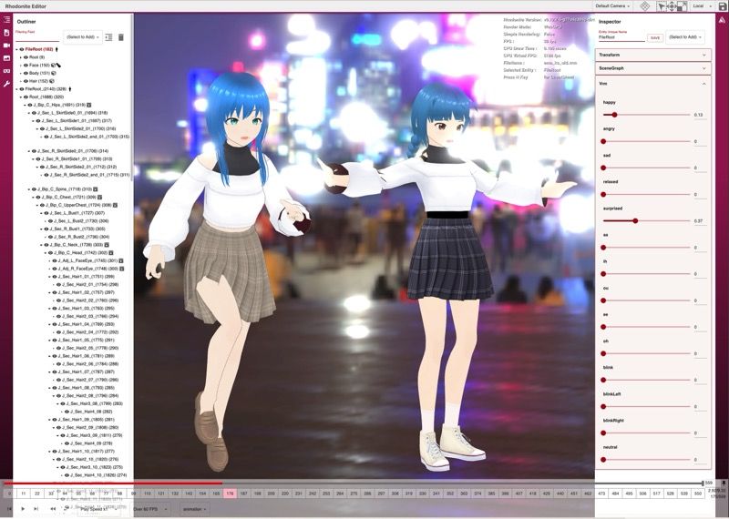
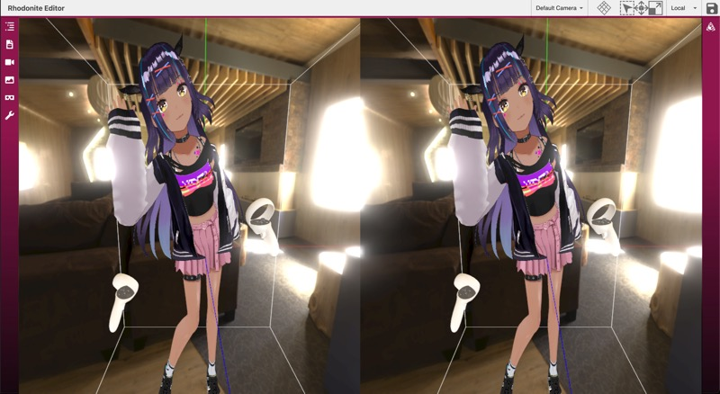

# Rhodonite


Rhodonite is a Web3D(WebGL2/WebGPU) library written in TypeScript.


## Official Website

https://librn.com/

## Feature

* Component-oriented
* Blittable Memory Architecture (Original GPU data storage system with floating point texture)
* Physically-based Rendering with Image-based Lighting
* Node-based Shader System
* Support loading the following 3D model files: [glTF2](https://github.com/KhronosGroup/glTF), glTF1, [VRM](https://vrm.dev/en/)
* Support [Draco compression](https://google.github.io/draco/), [Basis Universal](https://github.com/BinomialLLC/basis_universal) and [KTX2](http://github.khronos.org/KTX-Specification/), etc
* WebGPU Support
* WebXR(VR) Support (in WebGL mode)

## What's the "Blittable Memory Architecture"


With the Blittable Memory Architecture, Rhodonite stores almost all of its data in a large pre-allocated ArrayBuffer. Data storage for matrix or vector classes in Rhodonite's component classes and materials are assigned from the memory pool, which means most of the data are on that memory pool, transferred to the GPU every frame as a floating-point texture.
This architecture allows all shaders always to access a vast amount of data.

For example, Rhodonite can handle and blend all morph targets (38 targets) of VRM characters simultaneously in the shader.

## Viewer

You can try our library via https://editor.librn.com/.
This viewer supports glTF/VRM files Drag & Drop to display.
(Drag & Drop all files if glTF data consists of multiple files.)

Poly model


Advanced PBR


VRM avatar model and VRMA animation


Shader Node Editor


WebXR(VR) with [multiview](https://blog.mozvr.com/multiview-on-webxr/) extension


## Supported Browsers

Google Chrome, Firefox, Safari, Microsoft Edge (chromium-based), and other modern browsers are supported.
IE11 is not supported.

## Install

You can install Rhodonite easily.

```bash
$ npm install rhodonite
```

### Note

If you get an error like "webxr-input-profiles not found" when building a project using Rhodonite, Try "npm install" or "yarn install" again.

## Coding with Rhodonite

### In JavaScript

```html
<body>
  <canvas id="world"></canvas>
  <script src="../../../dist/umd/rhodonite.min.js"></script>
  <script>
  // Init Rhodonite
  await Rn.System.init({
    approach: Rn.ProcessApproach.DataTexture,
    canvas: document.getElementById('world'),
  });

  // create a Plane mesh
  const planeEntity = Rn.MeshHelper.createPlane();
  planeEntity.eulerAngles = Rn.Vector3.fromCopy3(Math.PI * 0.5, 0, 0);

  // Render Loop
  Rn.System.startRenderLoop(() => {
    Rn.System.processAuto();
  });
  </script>
</body>
```

### In TypeScript

There are two package versions of Rhodonite: ESModule and IIFE.

#### Using ESModule package

You don't need any bundler.

```html
<script type="module" src="main.js">
```

```typescript
// main.ts
import Rn from 'rhodonite/dist/esm/index.js';
// import Rn from 'rhodonite/dist/esmdev/index.js'; // use this if you want to display the source map or step through the library

// Init Rhodonite
await Rn.System.init({
  approach: Rn.ProcessApproach.DataTexture,
  canvas: document.getElementById('world') as HTMLCanvasElement,
});

// create a Plane mesh
const planeEntity = Rn.MeshHelper.createPlane();
planeEntity.eulerAngles = Rn.Vector3.fromCopy3(Math.PI * 0.5, 0, 0);

// Render Loop
Rn.System.startRenderLoop(() => {
  Rn.System.processAuto();
});
```

```
// tsconfig.json
{
  ...
  "compilerOptions": {
    "module": "ESNext",
    "moduleResolution": "node",
    "esModuleInterop": true,
    ...
  }
  ...
}
```

If you use bundler, you can simply import rhodonite, like

```
import Rn from 'rhodonite';
```

#### Using IIFE package

See the last part of https://github.com/actnwit/RhodoniteTS/wiki/Install .

## Building Rhodonite

### Prerequisites

* Node.js 22 or later

### Setup Project

```bash
$ yarn install
```

You can use yarn instead.

### Build command for Rhodonite library

```bash
$ yarn build
```

### Build command for samples

```bash
$ yarn build-samples
```

## Try Samples

After building Rhodonite, try:

```bash
$ yarn watch-samples
```

Then, access http://localhost:8082/ with your web browser.
When you are finished, press ctrl + c.

## Build command for API documents

```bash
$ yarn doc
```

## Testing Rhodonite

The following command runs unit tests and E2E tests.

```bash
$ yarn test
```

The E2E test uses a headless browser for rendering. Because the results are GPU hardware-dependent rather than software-dependent, results will vary depending on your environment.
Since the correct images were run in the library author's environment, it is likely that many tests will fail in your environment.

You can execute a part of tests like this.

### For unit test

```bash
$ yarn test-unit-part -- ./src/foundation/core
```

```bash
$ yarn test-unit-part -- ./src/foundation/core/Entity.test.ts
```

### For E2E (visual) test

```bash
$ yarn test-e2e-part -- ./samples/test_e2e/DataTextureInstancedDrawing
```

## Development using VSCode devcontainer

This project supports the VSCode devcontainer for any docker-installed OS.

Input the following command in the VSCode command palette.

```bash
> Remote-Containers: Reopen in Container
```

After a new dev container window opens, You can work in the Debian Linux container environment. All dependencies (node, npm, yarn, typescript, chromium, and all packages for Rhodonite) are already set up.

## Debugging inside VSCode (Step execution in VSCode Debug tab)

1. Install the "Debugger for Chrome" VSCode Extension.
2. Start the local server with `$ yarn start`.
3. Push the run icon by choosing "Launch Chrome to debug Rhodonite samples" in the RUN tab of VSCode's left pane to start debugging.

If you use the VSCode devcontainer environment, You should open another RhodoniteTS VSCode window locally and do debug ops on it instead of the devcontainer VSCode window.

## License

MIT License

## Acknowledgements

### Source Code

This library includes portions of code originally developed by the Khronos Group.
Some of these portions have been translated and modified for use in the RhodoniteTS library.
- glTF-Sample-Renderer (https://github.com/KhronosGroup/glTF-Sample-Renderer)

See [LICENSES/glTF-Sample-Renderer.LICENSE](LICENSES/glTF-Sample-Renderer.LICENSE) for details.

### Libraries

This library uses the following libraries.

* [immersive-web/webxr-input-profiles](https://github.com/immersive-web/webxr-input-profiles) (forked version)
* [enkimute/hdrpng.js](https://github.com/enkimute/hdrpng.js)
* [donmccurdy/KTX-Parse](https://github.com/donmccurdy/KTX-Parse)
* [donmccurdy/zstddec-wasm](https://github.com/donmccurdy/zstddec-wasm)

### Assets

This library also uses the following assets.

* [KhronosGroup/glTF-Sample-Assets](https://github.com/KhronosGroup/glTF-Sample-Assets)

### Contributors


